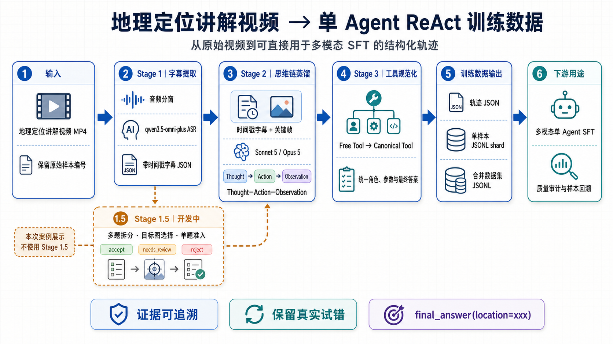
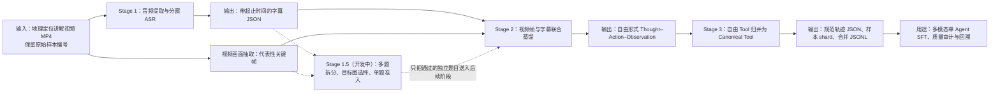

# 地理定位讲解视频思维链转化工作进展

## 一、目前已经能够实现的结果

我们当前负责的工作不是对视频做简单摘要，也不是把字幕原文重新排列，而是把地理定位高手在视频中展示的完整解题过程，转化为可以直接用于训练单 Agent 的多模态 ReAct 数据。对于一条输入视频，系统能够同时读取视频画面和带时间信息的语音内容，从讲解中识别“当前还缺少什么信息、为解决这个问题采取了什么动作、这个动作获得了什么新证据、证据如何改变候选地点、最终如何得到答案”，并将这些内容重建为连续的 `Thought–Action–Observation` 轨迹。这样得到的结果已经从面向观众的视频讲解，转变成了面向模型训练的 Agent 行为示范，训练目标不再只是让模型复述答案，而是让模型学习如何观察待定位图片、提出假设、调用合适的工具、读取工具结果、排除错误候选并输出最终地点。

从使用方式上看，目前流水线既可以处理单个 MP4 视频，也可以批量处理带有编号的视频集合。输入侧主要需要原始视频文件以及用于追踪样本的编号；如果视频本身没有可直接读取的字幕，Stage 1 会提取音频并调用 `qwen3.5-omni-plus` 完成带时间戳的 ASR，形成后续阶段能够准确对齐视频内容的字幕 JSON。Stage 2 同时接收这份时间戳字幕和从原视频中抽取的代表性关键帧，由 Sonnet 5 或 Opus 5 将人类讲解重建为自由形式的单 Agent 推理轨迹。Stage 3 再对自由工具进行规范化，整理消息角色和图像引用，最终输出可直接用于多模态 SFT 的 JSONL。每个视频的中间结果都会保留在独立目录中，原始编号也会保留在文件名和 `source_video` 等追踪字段里，因此无论是回查字幕、检查某一步推理，还是定位某条训练数据对应的源视频，都可以沿着同一个样本编号追溯。

一条视频经过完整处理后，会形成四类有不同用途的结果。第一类是带起止时间的字幕文件，它保留视频说了什么以及这些信息在什么时间出现，可用于证据核对和关键帧对齐；第二类是自由形式的 `stage2_freeform_tao.json`，其中每一步都包含 Thought、自由 Tool、参数和 Observation，并在最后用严格统一的 `final_answer` 工具输出 `location`；第三类是经过工具归并后的 `stage3_trajectory.json`，它把不同视频中含义相近但名称不同的自由工具映射到 Canonical Tool，降低工具名称随模型自由生成而无限扩张的问题；第四类是按样本切分的 JSONL shard 以及合并后的数据集 JSONL，其中已经包含 system、带图片引用的 user 消息、assistant 的 Thought/Action 以及 tool 的 Observation，可以直接进入多模态 SFT 数据加载流程，而不需要人工再把 JSON 改写成对话格式。

这一转化还会主动处理视频讲解与 Agent 训练目标之间的差异。原视频中常常包含开场白、广告、与观众互动、剪辑说明、重复叙述以及“UP 主接下来准备做什么”之类的媒体语言，这些内容对解题没有直接价值。Stage 2 会优先保留对定位有贡献的证据链，把“我在视频里看到作者打开了某网页”改写成 Agent 自己采取相应查询动作的表达，同时保留真实的试错过程。例如，某次地图搜索没有找到候选地点时，合理的轨迹不是把失败步骤删除，而是记录这次查询没有产生有效候选，并在下一步改变搜索范围或改用另一类证据。这样既去除了与任务无关的叙述，又没有把高手原本曲折的探索过程美化成一条事后编造的最短路径。

在最终答案方面，目前已经加入了明确的结构契约：轨迹的最后一步必须使用 `tool = "final_answer"`，参数必须写成 `{"location": "地点"}`，并且最后一步的 Observation 必须为 `null`。这解决了早期模型把答案写成 `result`、`site`、普通 Observation，或者虽然进行了很多推理却没有明确给出地点的问题。提示词同时要求模型不能自行补造字幕和画面中没有出现的精确经纬度、门牌号、注册号或搜索结果；如果讲解只支持到城市、道路或景点层级，就应当停留在证据实际支持的粒度，而不是为了让答案看起来完整而虚构更细的数据。

上一版稳定三阶段流水线已经在 `temp2` 的 31 条视频上完成了批量验证。两组实验使用完全相同的 31 份 Stage 1 字幕和 155 张关键帧，仅替换 Stage 2 模型，因此模型差异具有可比性。Sonnet 5 和 Opus 5 两组都实现了 Stage 2 的 31/31 成功、Stage 3 的 31/31 成功以及最终 JSONL 的 31 条完整输出，所有样本都满足统一的最终答案结构。需要特别说明的是，“工程上成功跑完”不等于“每一条都已经达到高质量训练标准”；进一步按照字幕证据检查答案、实体和 Observation 后，Sonnet 5 有 29/31 条可直接接受，Opus 5 有 27/31 条可直接接受。这个结果说明当前系统已经具备稳定批量生产候选训练数据的能力，同时仍然需要证据审计或质量门控，把少量实体听错、答案粒度越界和无依据 Observation 的样本挡在正式训练集之外。

## 二、整条流水线如何运转

下面的流程图以已经稳定跑通的三阶段版本为主。正在开发的 Stage 1.5 用虚线表示，它负责多题拆分、待定位图选择和单题质量门控，但目前仍处于迭代阶段，因此本次案例展示不使用 Stage 1.5 的结果。

### 1. Stage 1：把连续语音变成可定位、可核验的证据

Stage 1 的目标不只是得到一整段文字，而是建立视频时间轴与语言证据之间的对应关系。系统先从视频中提取音频，再按模型能够稳定处理的时长分窗发送给千问 ASR，最后把各分窗结果恢复到原视频时间轴，输出由 `start`、`end` 和 `text` 组成的字幕片段。带时间戳的设计非常重要，因为同一条长视频可能先展示待定位图，随后演示搜索过程，最后才公布答案；如果只有无时间信息的全文，模型很难判断某个地名是最初已知条件、中间候选还是最终答案，也无法将讲解中的“这座桥”“右侧建筑”与正确画面对应起来。时间戳字幕还为后续人工审计提供了直接证据，当模型写出一个地点或 Observation 时，可以回到对应秒数检查它是否真实出现。

### 2. Stage 2：从人类讲解重建为单 Agent ReAct 轨迹

Stage 2 是思维链转化的核心。它把关键帧提供的视觉信息与 Stage 1 的完整时间戳字幕放在同一个上下文中，要求模型理解讲解者解决问题的实际顺序，然后以 Agent 第一视角重写为多个连续步骤。每个步骤的 Thought 表达当前判断和信息缺口，Action 由自由 Tool 名称和结构化参数组成，Observation 只记录这次动作真实得到的新信息。自由 Tool 的存在使模型可以忠实表达视频中实际发生的行为，例如图片增强、文字识别、地图检索、太阳方位判断、历史云量查询、OSM 水系筛选、街景比对或历史影像核验，而不会因为预先定义的工具集合不够细而把不同动作强行压缩成同一个标签。

Stage 2 的提示词重点约束三个方面。第一，轨迹应当忠实于字幕和画面证据，不能把“看起来合理的推测”伪装成已经执行工具后得到的 Observation；第二，应当去掉广告、互动和视频制作话语，但保留对最终答案有作用的失败查询、候选排除和自我修正；第三，最终答案必须采用统一的 `final_answer/location` 结构，而且答案精度不能超过源材料能够支持的范围。经过这一阶段，输出已经能够单独阅读为一条完整的 Agent 解题轨迹，而不再依赖“视频作者说”“字幕里提到”等媒体语境。

### 3. Stage 3：在保留推理细节的同时统一训练接口

如果在 Stage 2 一开始就只允许少量固定工具，模型往往会为了满足枚举值而丢失高手真实使用的方法；但如果把自由工具直接作为训练集接口，不同样本又会产生大量同义名称。因此我们采用“先自由表达，再做规范化”的两阶段设计。Stage 3 根据工具语义、参数和上下文，将自由 Tool 映射为工具树中的 Canonical Tool，同时保留原始 Thought、参数和 Observation，最终再将轨迹转换为标准多轮消息。这样做兼顾了内容保真度与训练时的接口稳定性：Stage 2 可以完整蒸馏复杂方法，Stage 3 则负责控制工具命名、角色格式、图片引用以及终止答案结构。

Stage 3 还负责数据工程层面的可用性。每条样本既有独立的轨迹 JSON 和 JSONL shard，也能合并成统一数据集；每个 assistant 行为和 tool 返回在消息结构中有明确角色，训练时可以只对模型应该生成的部分计算损失；源视频编号、关键帧路径和阶段产物保持一致，发现问题后可以从最终 JSONL 一路回查到具体字幕时间和原视频画面。当前运行时工具树仍然会吸收一部分新工具，说明 Canonical Tool 池还需要继续治理，但归并阶段已经建立了稳定入口，不需要反过来推倒 Stage 2 的蒸馏逻辑。

### 4. 设计上的核心考虑

整个方案最重要的设计是把“内容蒸馏”和“接口规范”分开处理。内容蒸馏首先追求证据链正确、推理顺序自然以及高手方法不丢失，接口规范随后再解决工具名统一和 SFT 格式问题；这比在生成第一步就用硬规则限制所有工具更适合复杂且开放的地理定位视频。其次，我们把失败和不确定性视为有效训练信号：查询无结果可以作为 Observation，候选之间无法区分时应继续取证或降低置信度，但不能为了让轨迹显得顺畅而虚构一个成功搜索结果。最后，系统把自动生成与质量审计分成两个层次，批量跑通负责提高产量，字幕证据核验和准入标识负责保证训练集质量，使个别错误样本不会因为工程流程成功而被直接送入 SFT。

正在开发的 Stage 1.5 延续了这一思路。它准备解决一个视频包含多道题、每道题的待定位图片出现时间不同以及部分题目证据不足的问题。设计目标不是让一条视频“要么整条通过、要么整条失败”，而是先按字幕语义拆成独立题目，再为每道题选择真正需要定位的原始图片，对证据不足或目标图无法确认的题目打上 `needs_review` 或拒绝标识，只让通过的独立题目进入 Stage 2。由于这一部分目前仍在调整拆分和选图策略，本次进度汇报只介绍其设计方向，不用它作为质量案例。

## 三、建议展示的案例

### 案例选择：`25_BV1J64y1P7YV`

建议使用上一版 `temp2` 批次中的 `25_BV1J64y1P7YV` 作为主要演示案例。该题给出的是一张傍晚拍摄的宽阔水域照片，画面缺少可直接 OCR 的地名、路牌或唯一地标，只能利用落日方向、拍摄时间、远岸建筑尺度、植被、水体走向、山脊轮廓和历史水位等间接线索逐步缩小范围。这类案例比“识别到一个清晰地名后直接搜索”更能体现思维链转化的价值，因为它包含了视觉观察、外部信息查询、错误路线、候选筛选和多源交叉验证，最后还能在字幕中找到明确答案作为核验依据。

这条样本的字幕最终明确给出“云南省丽江市永胜县涛源镇”，并说明画面中的水体是金沙江，因此 Sonnet 5 输出的“云南省丽江市永胜县涛源镇”和 Opus 5 输出的“云南省丽江市永胜县涛源镇（金沙江）”都在证据支持范围内。两版使用相同的 Stage 1 字幕和相同的关键帧，且都通过了上一轮答案与 Observation 审计，没有依靠虚构经纬度或不明来源的精细数据完成定位，因此适合进行公平的模型对照。

### Sonnet 5 版本

Sonnet 5 将这一过程展开为 17 个步骤。它先根据照片中的落日和阴影判断镜头大致朝西，并通过增强图像、估算远岸建筑尺度、检查植被和天空状况建立初始视觉特征；随后查询拍摄日期附近的历史云量和不同区域的日落时间，用“画面拍摄于 18:54 时太阳仍在地平线附近”这一时间一致性条件排除江苏等不符合候选，保留云南方向；在进一步检查卫星云图后，它加载水系地图并查询 OSM，通过宽水面、东西走向、城镇聚落和山地背景筛选候选河段；最后再对比山脊轮廓、枯水期与丰水期水位以及当地航拍影像，确认云南丽江永胜县涛源镇，并用统一的 `final_answer` 工具结束轨迹。

Sonnet 版本的主要优点是步骤拆分清楚，基本按照讲解者的实际取证顺序推进，每一步都容易回答“为什么要做这个动作”和“这个动作给下一步增加了什么证据”。它对失败和候选变化保留得比较完整，同时没有把最终已知答案提前泄漏到前面的 Observation 中。对于 SFT 来说，这种粒度有利于模型学习从信息缺口出发选择下一种工具，而不是只学习一个长段落式的结论。该版本的最终答案更保守，只输出讲解明确确认的行政地点，没有主动添加更细粒度坐标或地址，适合作为本次汇报中的主展示版本。

Sonnet 5 结果文件：

`temp2_results_sonnet5/intermediate/25_BV1J64y1P7YV/stage2_freeform_tao.json`

### Opus 5 版本

Opus 5 使用 15 个步骤完成同一定位。它同样从太阳方位、图像增强和尺度估算开始，但会把多个相近观察组织在更结构化的 Observation 中；在历史云量与日落时间查询中，它明确比较江苏约 17:06 和云南约 18:22 的日落差异，并用 18:54 的画面状态支持云南候选；当普通水系地图扫描无法唯一锁定地点时，它会直接记录该方法未能解决问题，再切换到 OSM、山脊透视、多时相水位和航拍影像；最后增加行政区与水体名称核验，输出“云南省丽江市永胜县涛源镇（金沙江）”。

Opus 版本的优势是 Observation 通常更丰富，证据状态表达得更明确，例如它会区分“查询结果”“仍未验证的候选”和“该方法没有得到唯一答案”，而不是让每个工具看起来都必然成功。它还保留了字幕中明确出现的“金沙江”这一水体信息，使最终结果的信息量略高。相较 Sonnet，Opus 更倾向于把相关动作合并为较密集的步骤，因此轨迹总步数稍少，但单步内容更长，适合作为同一案例的对照版本，展示在相同输入下模型如何采用不同的组织方式表达同一条证据链。

Opus 5 结果文件：

`temp2_results_opus5/intermediate/25_BV1J64y1P7YV/stage2_freeform_tao.json`

### 两个版本的展示对比

| 对比项 | Sonnet 5 | Opus 5 |
|---|---|---|
| 输入 | 与 Opus 完全相同的时间戳字幕和关键帧 | 与 Sonnet 完全相同的时间戳字幕和关键帧 |
| 轨迹长度 | 17 步，动作拆分更细 | 15 步，单步 Observation 更密集 |
| 最终答案 | 云南省丽江市永胜县涛源镇 | 云南省丽江市永胜县涛源镇（金沙江） |
| 表达特点 | 顺序清楚、过程细、易观察每一步的决策作用 | 结构化程度高、失败状态和证据状态描述更充分 |
| 适合角色 | 主生产模型与主展示版本 | 第二候选、交叉审查或高难样本补充版本 |

从 31 条上一版批量实验的整体结果看，建议仍将 Sonnet 5 作为默认 Stage 2 模型，把 Opus 5 作为第二候选或审查模型。两者工程成功率相同，最终结构契约也都能满足，但人工严格审计后 Sonnet 可直接接受 29 条，Opus 可直接接受 27 条；Sonnet 在人名、地名和最终实体抄写上整体更稳，Opus 则在 Observation 的结构和细节上更丰富。对于本案例，两版都属于高质量结果，因此展示时可以先用 Sonnet 讲清楚主流程，再放 Opus 的对应结果说明“同一份视频可以替换 Stage 2 模型进行对照，系统的上下游接口和 Stage 3 输出不需要改变”。

## 四、案例展示时可以直接使用的介绍文字

下面展示的是我们上一版批量结果中的第 25 条视频。原题只有一张傍晚水域照片，没有清晰文字和唯一地标，定位过程需要综合落日方位、拍摄时间、云量、远岸建筑尺度、水体走向、山脊轮廓和季节性水位等多类证据。我们的流水线首先把视频讲解转成带时间戳的字幕，再把关键帧和字幕共同交给 Stage 2，使模型不是简单复述视频，而是把高手的实际操作重建成一条可以训练 Agent 的 Thought–Action–Observation 轨迹。可以看到，轨迹中既有图像增强和尺度估算，也有历史云量、日落时间、OSM 水系、山脊和航拍影像等外部工具查询，还保留了某些方法没有唯一结果后切换证据来源的过程，最后统一用 `final_answer/location` 输出地点。

这条案例适合展示的原因，是它同时具备完整性、可核验性和方法多样性。完整性体现在从初始视觉判断到最终地点确认的逻辑链没有断裂；可核验性体现在字幕最后明确给出了云南省丽江市永胜县涛源镇以及金沙江，可以检查模型有没有偏离源证据；方法多样性则体现了地理定位 Agent 不只是做一次图片搜索，而是能够根据当前缺少的信息选择不同工具，并利用新 Observation 更新候选。Sonnet 5 版本更细致地拆分每个动作，适合作为主要训练轨迹展示；Opus 5 版本对失败状态和 Observation 的结构表达更充分，并补充了字幕支持的金沙江信息，可以作为对照版本帮助我们决定后续是选择单一主模型，还是采用“Sonnet 生成、Opus 复核”的组合方式。

## 五、当前能力边界与下一步

当前版本已经证明，可以把一批原始视频稳定转化为结构统一、可追溯且能够进入多模态 SFT 的候选 ReAct 数据，但自动生成结果仍不能在没有审计的情况下全部视为金标准。主要风险包括 ASR 对罕见地名、编号和方言的误识别，模型把合理推断写成已经查询得到的 Observation，最终答案粒度超过字幕证据，以及自由工具继续扩张导致 Canonical Tool 池不够稳定。下一步应当继续完善 Stage 1.5 的多题拆分、目标图选择和单题准入，将“视频级处理”细化为“题目级处理”；同时对 Stage 2 增加逐步证据引用或时间戳来源，让每一个 Observation 都能明确回指字幕区间或画面；对于 Sonnet 与 Opus，可以优先采用 Sonnet 批量生成，再对答案实体、低置信样本和模型分歧样本调用 Opus 复核，在控制成本的同时提高进入正式训练集的数据质量。
